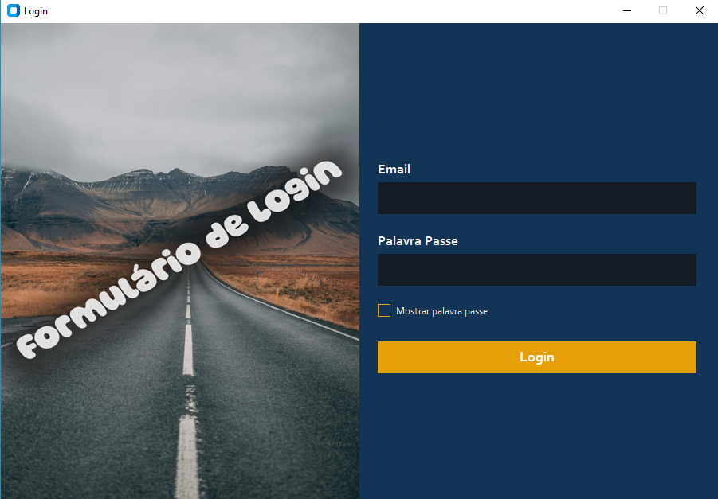

## BIBLIOTECAS QUE DEVEM SER INSTALADAS
- CustomTkinter
- Pillow
- SQLite

## COMO INSTALAR?

```bash
    pip install customtkinter pillow sqlite3
```

## COMO RODAR O PROGRAMA?

```bash
    py main.py
```

*NOTA: Já existem alguns registros na base de dados "database.db" para testar*